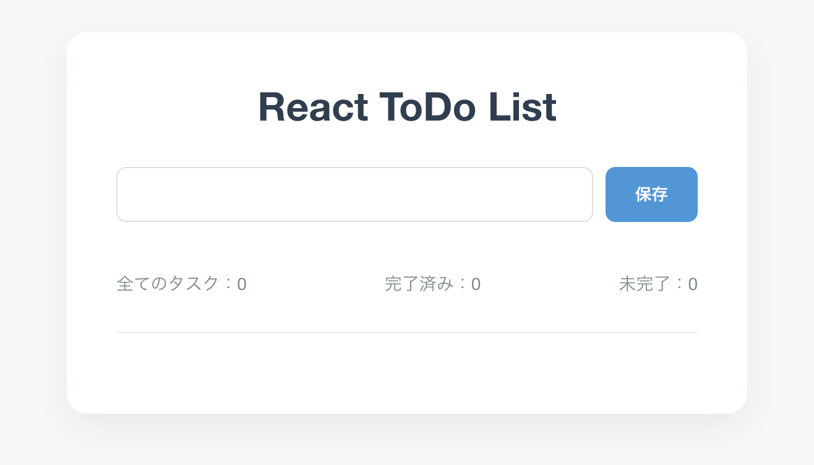
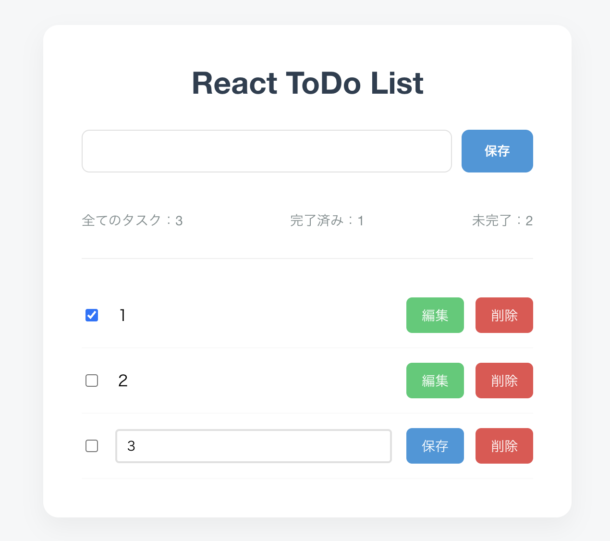

# React ToDo List

**デモURL:** https://kenichi585-sys.github.io/react_todo_list/

| **初期画面**                     | **Todo追加後の画面**         |
| -------------------------------- | ---------------------------- |
|  |  |

React 学習の一環として作成したToDo 管理アプリです。タスクの追加・編集・削除・完了切替を行い、localStorage に永続化保存をします。

## 主な機能

- タスクの追加・編集・削除
- 完了 / 未完了の切り替え
- 全件・完了・未完了件数の表示
- localStorage によるデータ永続化
- Enter キーでの保存（日本語 IME 入力中は発火しない）
- 空入力・空白のみのバリデーション
- 削除前の確認ダイアログ

## 技術スタック

| 区分           | 技術                          |
| -------------- | ----------------------------- |
| フロントエンド | React 19                      |
| ビルド         | Vite 8                        |
| スタイリング   | CSS（外部 UI ライブラリなし） |
| Lint           | ESLint                        |
| ホスティング   | GitHub Pages                  |

## 設計・構成

### コンポーネント分割

| コンポーネント                                          | 役割                                       |
| ------------------------------------------------------- | ------------------------------------------ |
| [`App.jsx`](src/App.jsx)                                | ルート。`TodoContainer` を描画             |
| [`TodoContainer.jsx`](src/components/TodoContainer.jsx) | 状態管理・CRUD ロジック・localStorage 連携 |
| [`TodoItem.jsx`](src/components/TodoItem.jsx)           | 1 タスクの表示・編集 UI                    |

### 状態設計

[`TodoContainer.jsx`](src/components/TodoContainer.jsx) で以下の state を管理しています。

- `todos` — タスク配列（`id`, `text`, `isCompleted`）
- `inputText` — 新規入力欄
- `editingId` + `editText` — 編集中のタスクを 1 件だけ管理

### 永続化

- キー: `"my_todo"`
- 初回: `useState` の lazy initializer で `localStorage` から読み込み
- 更新: `todos` 変更時に `useEffect` で保存

### UX 上の配慮

- `onKeyDown` で `e.nativeEvent.isComposing` を確認し、日本語変換確定前の Enter を無視
- 空文字・空白のみは `alert` で弾く
- 削除前に `window.confirm`

## ディレクトリ構成

```
react_todo_list/
├── docs/  # 初期画面等のスクリーンショットが入っている
├── public/
├── src/
│   ├── components/
│   │   ├── TodoContainer.jsx
│   │   └── TodoItem.jsx
│   ├── App.jsx
│   ├── App.css
│   └── main.jsx
├── index.html
├── package.json
└── vite.config.js
```

## セットアップ

### 初回セットアップ

リポジトリの clone と依存パッケージのインストールのみ行います。

```bash
git clone https://github.com/Kenichi585-sys/react_todo_list.git
cd react_todo_list
npm install
```

### 利用可能なコマンド

以下は目的に応じて個別に実行します。

| コマンド        | 用途                                         |
| --------------- | -------------------------------------------- |
| `npm run dev`   | 開発サーバーを起動し、ブラウザで動作確認する |
| `npm run build` | 本番用ファイル（`dist/`）を生成する          |
| `npm run lint`  | ESLint によるコードチェックを実行する        |

